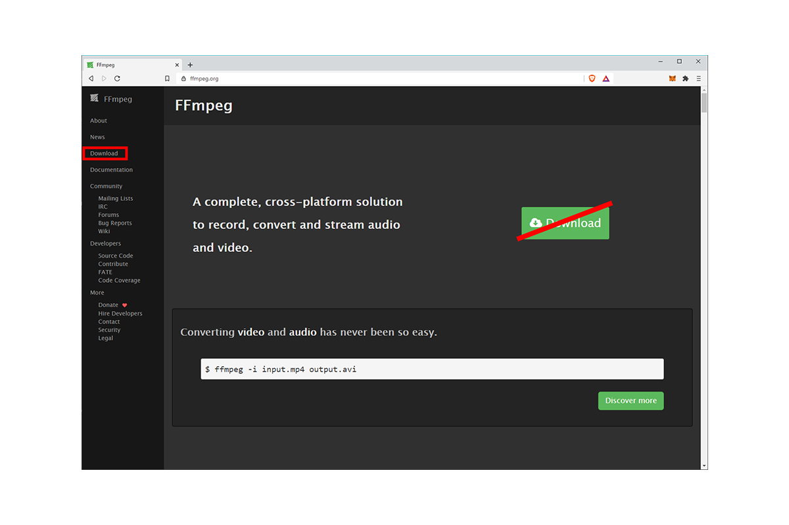

<b>
FFmpeg Controller Grasshopper plug-in (GPL) initiated by Marc Differding and Antoine Maes 
</b>

---

Tapeworm is a free and open source multimedia plugin for Grasshopper for Windows and macOS written in Python. 

Tapeworm currently allows you to create videos from image sequences and *vis versa*, transcode between various image formats, rename entire image sequences, and much more. Past are the times, when you had to use some obscure websites, or sign up for an expensive software subscription.

Tapeworm uses the free and open source FFmpeg project - a cross-platform command-line-based program for transcoding multimedia files -, and offers some of its functionality to Grasshopper users. For various reasons, we decided not to include a build of FFmpeg in the current Tapeworm release, which means that you have to install it yourself (if you don't already have it).

# Table of Contents
<!--ts-->
   * [License](#License)
   * [Tapeworm Installation](#Tapeworm-Installation)
   * [FFmpeg Installation](#FFmpeg-Installation)
       * [Install FFmpeg on Windows](#Install-FFmpeg-on-Windows)
       * [Install FFmpeg on macOS](#Install-FFmpeg-on-macOS)
   * [Credits](#Credits)
   * [Useful Links](#Useful-Links)
<!--te-->

# License
Tapeworm: FFmpeg Controller Grasshopper plug-in (GPL) intiated by Marc Differding and Antoine Maes

Copyright (c) 2020-2021, Marc Differding and Antoine Maes

Tapeworm is a free software; you can redistribute it and/or modify it under the terms of the GNU General Public License as published by the Free Software Foundation; either version 3 of the License, or (at your option) any later version.

Tapeworm is distributed in the hope to be useful, but WITHOUT ANY WARRANTY; without even the implied warranty of MERCHANTABILITY or FITNESS FOR A PARTICULAR PURPOSE. See the GNU General Public License for more details.

You should have received a copy of the GNU General Public License along with Tapeworm; if not see <http://www.gnu.org/licenses/>.

@license GPL-3.0 <http://www.gnu.org/licenses/gpl.html>

# Tapeworm Installation
1. Download the latest Tapeworm release from [Food4Rhino](https://www.food4rhino.com/app/tapeworm) or [GitHub](https://github.com/diff-arch/Tapeworm/releases).
2. Unzip the downloaded file (your internet browser might already have done this for you).
3. Inside the extracted folder, you will - find amongst other files - a folder called *Tapeworm*, and a folder named *Tapeworm_UserObjects*:
    
     
    
    - Move the folder named **Tapeworm** to the Grasshopper *Libraries* folder. You can open the *Libraries* folder by going to **File > Special Folders > Components Folder** in the Grasshopper menu bar.
    - Move the folder named **Tapeworm_UserObjects** to the Grasshopper *UserObjects* folder. You can again access to the **UserObjects** folder by going to **File > Special Folders > User Object Folder**.
5. Relaunch Rhino.

**Note:** Rhino 5 users additionnally need to install the [GHPython plugin](https://www.food4rhino.com/app/ghpython) for Grasshopper.

# FFmpeg Installation
You only need to install FFmpeg, if it isn't already installed on your computer!

Tapeworm should automatically detect existing FFmpeg installations.

## Install FFmpeg on Windows

  
Click to expand!

    
1. Go to [ffmpeg.org](https://ffmpeg.org) and select **Download** from the left navigation

2. Hover your mouse over the Windows logo, then click on the link shown in the image below

3. Scroll down a little and download the latest stable FFmpeg by selecting the link showed in the image below

4. Unzip the downloaded **ffmpeg** 

7. Move the extracted folder (whatever its name) to your `C:/` drive

8. Voilà !

## Install FFmpeg on macOS

  
Click to expand!

  
  #### Manual Installation
1. Go to [ffmpeg.org](https://ffmpeg.org) and select **Download** from the left navigation

2. Click on the image showing the Apple logo, or alternatively on **Static builds for macOS 64-bit** below

3. Download the latest stable FFmpeg binary by selecting **Download as ZIP** under **ffmpeg-4.x.x.7z**

4. Unzip the downloaded **ffmpeg** binary (your internet browser might already have done this for you)

    On macOS, binaries like **ffmpeg** are usually installed in `/usr/local/bin`.
    For Tapeworm, it doesn't really matter where you put **ffmpeg**, since it should get auto-detected.
    The following steps are thus optional, but recommended!

5. In Finder, select **Go > Go to Folder...** from the top toolbar, or use the keyboard shortcut <kbd>SHIFT</kbd> + <kbd>CMD</kbd> + <kbd>G</kbd>

6. Navigate to the folder `/usr/local/bin`

7. Move the unzipped **ffmpeg** binary to `/usr/local/bin`

    If your **ffmpeg** icon does not depict a small, black terminal window - like the one above - your binary has no executable rights (can't be opened as a command line tool), and you need to follow the following, additional steps to fix this:

8. Open a terminal (`Applications/Utilities/Terminal.app`)

9. Make the **ffmpeg** binary executable by entering `sudo chmod +x /usr/local/bin/ffmpeg`, and confirm with your password

    The **ffmpeg** binary icon should now show the tiny, black terminal window.

10. And you're done!

#### Installation with Homebrew
You obviously need to have the [Homebrew](https://brew.sh/) package manager installed for this to work.

1. Open a terminal (`Applications/Utilities/Terminal.app`)
2. Enter `brew install ffmpeg`

3. Easy peasy!

# Credits
The algorithm for computing the Levenshtein distance between two strings was derived from pseudo-code found in the same-named [wikipedia article](https://en.wikipedia.org/wiki/Levenshtein_distance#Iterative_with_two_matrix_rows) and translated to Python.

Some organizational and structural parts of the code are based on Andrea Rossi's [Wasp](https://github.com/ar0551/Wasp), a free and open-source plugin for discreet design in Grasshopper.

# Useful Links
[FFmpeg](https://ffmpeg.org/)

[Antoine Maes](https://www.antoinemaes.com/)
